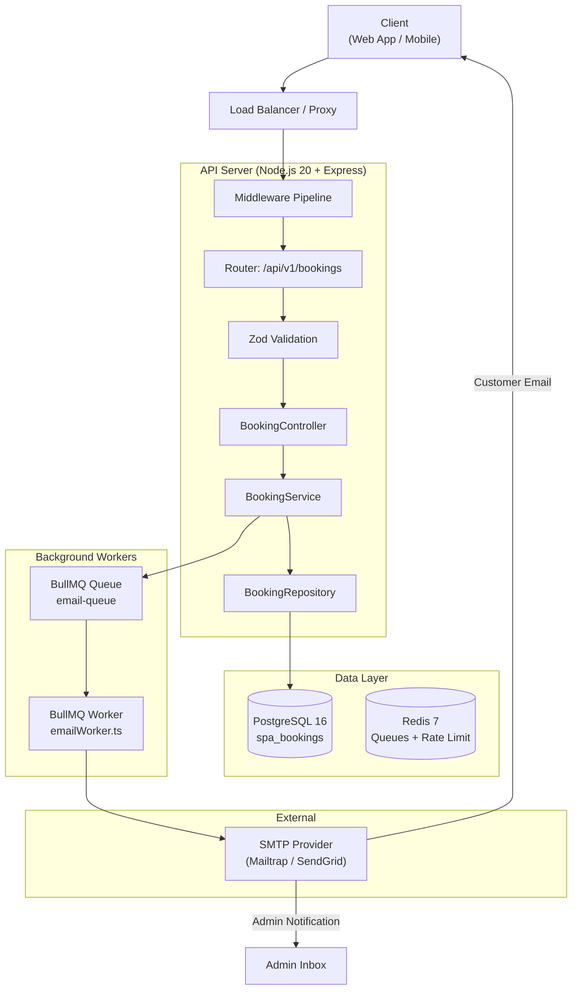
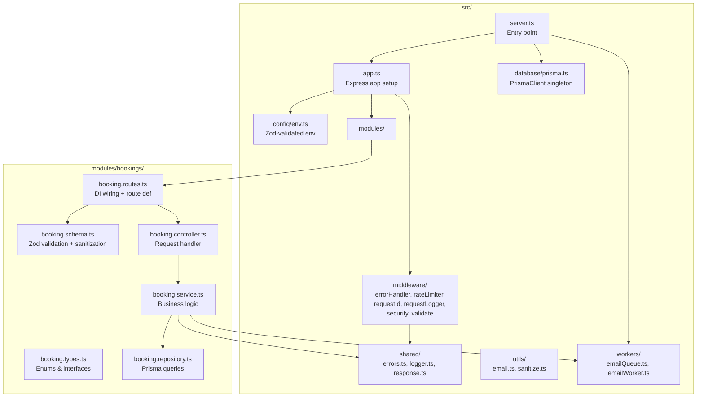
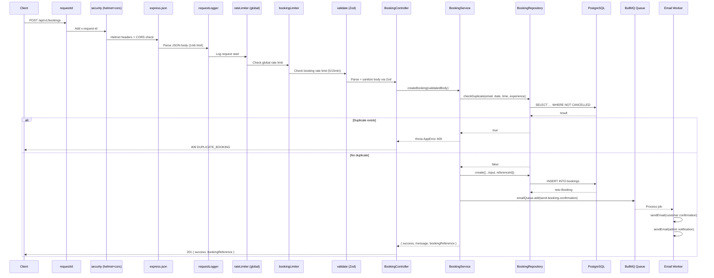
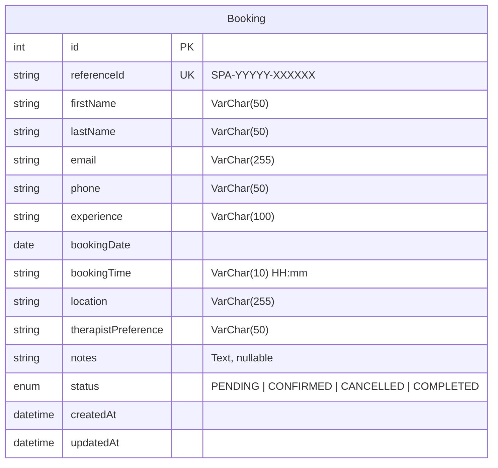
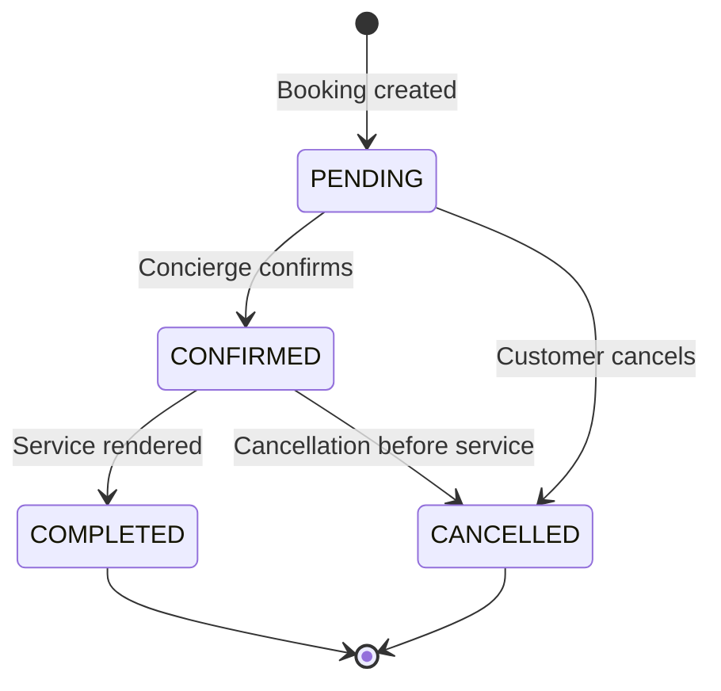
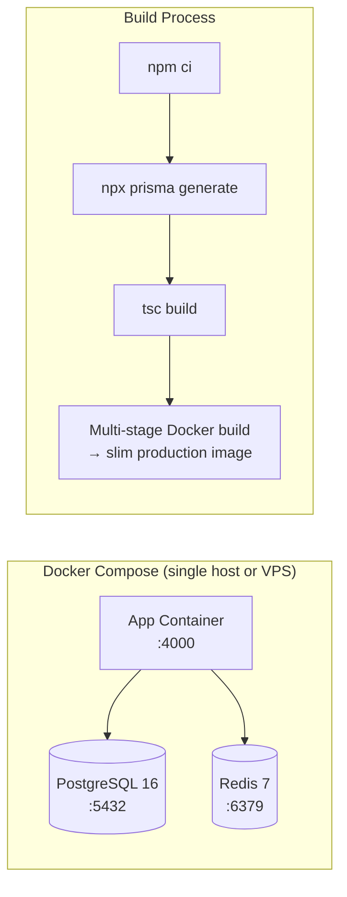
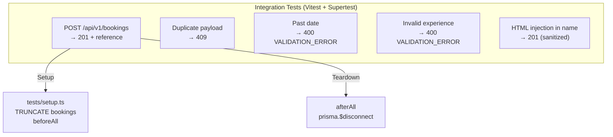

# Serenity Spa Booking Backend — Architecture Overview

## 1. Tech Stack

| Layer | Technology | Purpose |
|-------|-----------|---------|
| **Runtime** | Node.js 20 (LTS) + TypeScript 5.7 | Type-safe server-side execution |
| **Framework** | Express 4.21 | HTTP routing & middleware pipeline |
| **Database ORM** | Prisma 5.22 + PostgreSQL 16 (Alpine) | Data access, migrations, type-safe queries |
| **Cache / Queue Broker** | Redis 7 (Alpine) + BullMQ 5.12 | Background job queue + rate-limit store |
| **Validation** | Zod 3.24 | Request body parsing & validation |
| **Logging** | Pino 9.5 + pino-pretty | Structured JSON logging |
| **Email** | Nodemailer 6.9 + Mailtrap (dev) / SMTP (prod) | Transactional email delivery |
| **Testing** | Vitest 2.1 + Supertest 7 | Unit & integration testing |
| **Security** | Helmet 8, CORS, express-rate-limit 7, rate-limit-redis | HTTP hardening, cross-origin, rate limiting |
| **Containerization** | Docker + Docker Compose | Service orchestration (postgres, redis, app) |

---

## 2. System Architecture (High-Level)

---

## 3. Directory Structure & Module Map

---

## 4. Middleware Pipeline (Request Lifecycle)

---

## 5. Database Schema

**Status Lifecycle:**

---

## 6. Critical Business Logic

### 6.1 Booking Creation (`booking.service.ts:8-33`)

1. **Duplicate detection** — Looks for an existing non-cancelled booking with the same email, date, time, and experience. Returns `409 DUPLICATE_BOOKING` if found.
2. **Reference ID generation** — Uses `nanoid` with a custom alphabet (A-Z, 0-9, 6 chars) prefixed by `SPA-{year}-`. Example: `SPA-2026-X7K9M2`.
3. **DB insert** — Persists the booking with `PENDING` status in PostgreSQL via Prisma.
4. **Async email dispatch** — Enqueues a BullMQ job to `email-queue`. The worker sends:
   - Customer confirmation email with booking details
   - Admin notification email to `EMAIL_ADMIN`
5. **Idempotent response** — Returns `{ success: true, message, bookingReference }`.

### 6.2 Validation Pipeline (`booking.schema.ts`)

- **XSS prevention** — `sanitizeInput` strips HTML tags and `javascript:` URIs from `firstName`, `lastName`, `location`, and `notes`.
- **Date constraint** — Booking date must be **tomorrow or later** (same-day booking not allowed).
- **Time format** — Strict `HH:mm` regex matching 24-hour format.
- **Experience whitelist** — Enum of 11 predefined spa experiences.
- **Therapist preference** — Enum of 5 options including free-text fallback.

### 6.3 Rate Limiting (`middleware/rateLimiter.ts`)

| Limiter | Window | Max Requests | Redis Prefix |
|---------|--------|-------------|--------------|
| `apiLimiter` | `RATE_LIMIT_WINDOW_MS` (default 15 min) | `RATE_LIMIT_MAX_REQUESTS` (default 100) | `rl:api:` |
| `bookingLimiter` | 15 min | 5 | `rl:booking:` |

Falls back to in-memory store if Redis is unavailable.

### 6.4 Error Handling (`middleware/errorHandler.ts`)

- **AppError** — Custom error class with `code`, `message`, and `statusCode`. Supports optional `fieldErrors` for validation details.
- **Async handler** — Wraps async route handlers to forward rejected promises to Express `next()`.
- **Format** — All errors return `{ success: false, error: { code, message } }` with optional `fields` map for validation errors.

### 6.5 Email Worker (`workers/emailWorker.ts`)

- Uses BullMQ with exponential backoff (3 attempts, 2s initial delay).
- Sends two emails per job: customer confirmation + admin notification.
- Silently skips sending in test environment or when no SMTP transport is configured.

---

## 7. Configuration & Environment

All environment variables are validated at startup via Zod schema in `src/config/env.ts:7-30`. Key variables:

| Variable | Default | Description |
|----------|---------|-------------|
| `PORT` | 4000 | HTTP server port |
| `DATABASE_URL` | — | PostgreSQL connection string |
| `REDIS_URL` | — | Redis connection string |
| `CORS_ORIGIN` | `http://localhost:3000` | Comma-separated allowed origins |
| `RATE_LIMIT_WINDOW_MS` | 900000 | Rate limit window in ms |
| `RATE_LIMIT_MAX_REQUESTS` | 100 | Max requests per window |
| `SMTP_HOST` / `SMTP_PORT` / `SMTP_USER` / `SMTP_PASS` | — | Email transport credentials |
| `EMAIL_FROM` / `EMAIL_ADMIN` | — | Sender and admin recipient addresses |
| `LOG_LEVEL` | `info` | Pino log level |

---

## 8. Deployment Architecture

**Startup sequence** (`entrypoint.sh`):
1. Check file structure and env vars
2. Run `prisma migrate deploy` (or `prisma db push` if no migrations exist)
3. Start `node dist/server.js`

---

## 9. Known Constraints & Considerations

| Constraint | Impact | Mitigation |
|-----------|--------|------------|
| **No auth/authz** | Public booking endpoint — anyone can create bookings without authentication | Rate limiting, duplicate detection, CORS whitelist |
| **No user accounts** | No customer login, profile, or booking history retrieval | Booking reference ID is the only identifier returned |
| **Single module** | Only `bookings` module exists; no service catalog, staff management, or payment processing | Future modules can follow the same controller-service-repository pattern |
| **No migration files in repo** | `prisma/migrations/` directory absent; `entrypoint.sh` falls back to `prisma db push` | Would lose schema history; should generate initial migration with `prisma migrate dev` |
| **No TLS termination** | Docker Compose exposes app directly on :4000 without HTTPS | Should add reverse proxy (nginx/Caddy/Traefik) for production TLS |
| **Same-day bookings disabled** | `date >= tomorrow` validation constraint | Business rule — could be made configurable |
| **Redis as single point of failure** | Rate limits and email queue both depend on Redis | In-memory fallback for rate limiting; BullMQ retries handle brief outages |
| **Email is best-effort only** | No retry queue dead-letter handling, no webhook confirmation | BullMQ attempts 3 retries with exponential backoff |
| **No API versioning prefix** | Routes use `/api/v1/bookings` hardcoded | Version segment is present but no version negotiation/header support |
| **No request body size limit** | `express.json({ limit: '1mb' })` limits JSON body to 1MB | Adequate for current use case |
| **Database enum vs Prisma enum** | `BookingStatus` is a Prisma enum mapped to PostgreSQL enum | Adding new statuses requires migration |

---

## 10. Testing Strategy

Tests truncate the bookings table before each run and currently cover: happy-path creation, duplicate detection, date validation, enum validation, and XSS sanitization.

---

## 11. Key Metrics & Performance

- **Database** — Single table `bookings`; no indexes beyond the auto-generated PK on `id` and unique on `reference_id`. The `checkDuplicate` query scans for `email + booking_date + booking_time + experience + NOT CANCELLED` — a composite index on these columns would improve performance at scale.
- **Queue** — BullMQ with Redis provides at-least-once delivery; each booking creates exactly one queue job.
- **Memory** — PrismaClient is a singleton; Pino logging is async; middleware is synchronous.
- **Concurrency** — Node.js event loop handles all requests; rate limiting prevents abuse; database connection pool managed by Prisma.

---

*Generated from codebase analysis — Sun May 31 2026*
